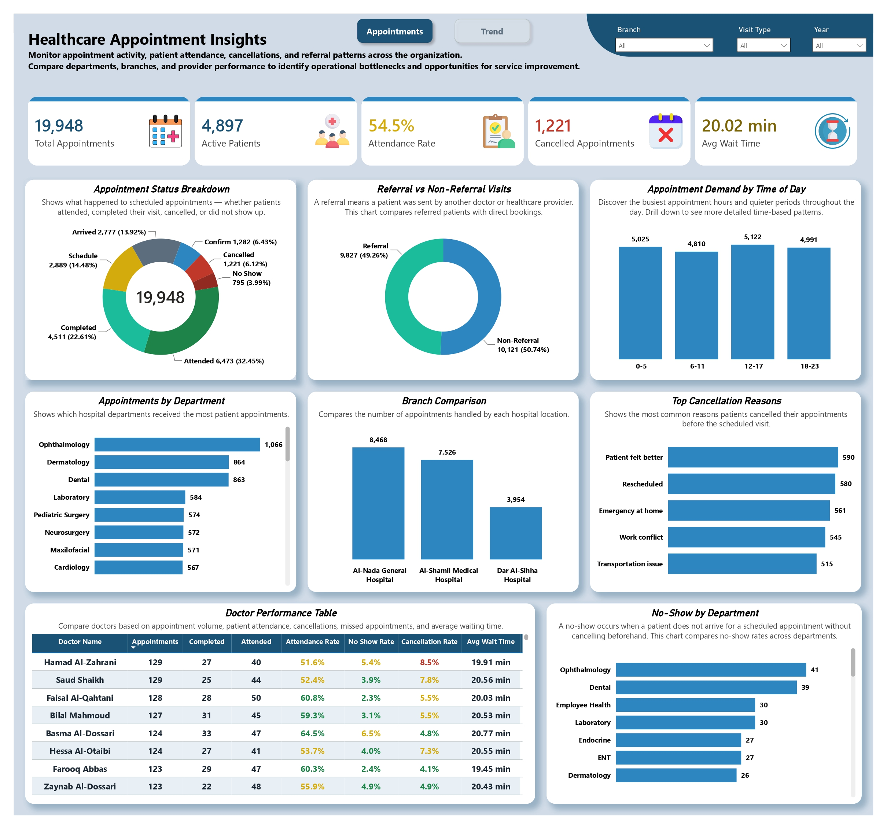
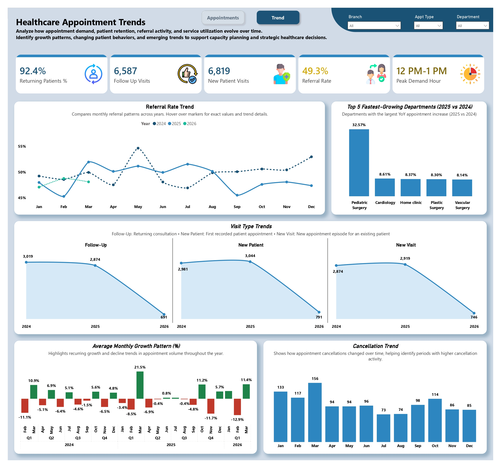

# 🏥 Healthcare Appointments Insights & Trends
### An Enterprise-Grade Operational Analytics Dashboard | Power BI

---

> **"Turning appointment scheduling data into operational intelligence — surfacing attendance patterns, cancellation drivers, and provider performance to support smarter capacity planning."**

---

## 📋 Table of Contents
- [Executive Summary](#executive-summary)
- [Problem Statement](#problem-statement)
- [Dashboard Preview](#dashboard-preview)
- [Key Insights & Findings](#key-insights--findings)
- [Technical Architecture](#technical-architecture)
- [Project Documentation](#project-documentation)
- [Repository Structure](#repository-structure)
- [Tools & Technologies](#tools--technologies)
- [About the Analyst](#about-the-analyst)

---

## Executive Summary

This project delivers a **two-page interactive Power BI dashboard** built on anonymized real-world appointment scheduling data from a **3-branch healthcare network**. The dataset spans **19,948 appointments** across three calendar years (2024–2026), covering attendance behavior, referral activity, departmental load, and individual doctor performance.

The dashboard equips healthcare operations leadership, department heads, and executives with a single source of truth for monitoring appointment flow — replacing static end-of-month reports with a live, drillable, filterable analytics platform built for day-to-day operational decision-making.

**Scope at a glance:**

| Metric | Value |
|---|---|
| Total Appointments Analyzed | 19,948 |
| Data Period | 2024 – 2026 |
| Dashboard Pages | 2 (Appointments & Trends) |
| Branches Covered | 3 |
| Active Patients | 4,897 |
| Overall Attendance Rate | 54.5% |
| Returning Patients | 92.4% |

---

## Problem Statement

Multi-branch healthcare networks generate enormous volumes of appointment data every day, yet most of it sits unused in scheduling systems — disconnected from the operational decisions it should inform. Leadership teams are frequently unable to answer fundamental questions:

- How many scheduled appointments actually result in a completed visit — and how many are no-shows or cancellations?
- Which departments and branches are overloaded, and which have spare capacity?
- Why are patients cancelling, and which reasons are most preventable?
- How does each doctor perform on attendance, no-show rate, and average wait time?
- Are referral and new-patient volumes growing or shrinking over time, and which departments are scaling fastest?
- What time of day and what hour sees peak demand, and how should staffing reflect that?

This project was built to close that gap — converting raw appointment records into a structured, interactive intelligence layer that supports capacity planning, staffing decisions, and service-quality improvements across the organization.

---

## Dashboard Preview

### Page 1 — Healthcare Appointment Insights
> *Operational snapshot: appointment status breakdown, referral mix, department load, branch comparison, cancellation reasons, doctor performance, and no-show analysis by department.*

<!-- INSTRUCTIONS: Replace the line below with your actual image -->


---

### Page 2 — Healthcare Appointment Trends
> *Time-based analysis: referral rate trends, fastest-growing departments, monthly growth patterns, cancellation trends, and visit-type trends (follow-up, new patient, new visit) across years.*

<!-- INSTRUCTIONS: Replace the line below with your actual image -->


---

## Key Insights & Findings

### 📅 Appointment Outcomes
- Of 19,948 total appointments, only **32.45% (6,473)** reached "Attended" status, while **22.61% (4,511)** were marked Completed — together representing the bulk of fulfilled visits
- **No-shows accounted for 3.99% (795)** of all appointments, and **cancellations for 6.12% (1,221)** — together representing over 2,000 lost appointment slots
- The overall **attendance rate stands at 54.5%**, highlighting a meaningful opportunity for process improvement in scheduling and reminders

### 🏢 Departmental & Branch Load
- **Ophthalmology (1,066)** receives the highest appointment volume, followed by Dermatology (864) and Dental (863)
- **Al-Nada General Hospital** handles the largest share of appointments (8,468), more than double Dar Al-Sihha Hospital (3,954)
- **Ophthalmology and Dental** also lead in no-show counts (41 and 39 respectively), suggesting these departments may benefit most from improved reminder systems

### ❌ Cancellations
- The top cancellation reason is **"Patient felt better" (590 cases)**, followed closely by Rescheduling (580) and Emergency at home (561)
- These top five reasons are nearly evenly distributed, indicating no single dominant cause — suggesting a multi-pronged retention strategy is needed rather than one fix

### 👨‍⚕️ Doctor Performance
- Attendance rates among top doctors range from **51.6% to 64.5%**, with **Basma Al-Dossari** posting the highest rate (64.5%) and lowest no-show rate concerns balanced against cancellation rate
- Average wait times across doctors are tightly clustered between **19.45 and 20.77 minutes**, indicating consistent scheduling discipline across providers

### 📈 Trends Over Time
- **Pediatric Surgery grew 32.57% year-over-year (2025 vs 2024)** — by far the fastest-growing department, suggesting a shift in service demand or capacity expansion
- **Referral rate sits at 49.3% overall**, with monthly referral patterns fluctuating between 45% and 55% across the three years
- **Returning patients make up 92.4%** of visits — a strong indicator of patient retention and trust in the network
- **Peak demand hour is 12 PM–1 PM**, with the 12–17 (afternoon) time block seeing the highest appointment volume (5,122) of the four daily time segments
- March consistently shows elevated cancellation volume across years (156 in the most recent year), warranting a closer look at seasonal patterns

---

## Technical Architecture

### Data Pipeline

```
Raw Scheduling Data → SQL Queries → Power Query (ETL) → Data Model → DAX Measures → Power BI Visuals
```

### Data Model Highlights
- **SQL** used to extract and pre-filter appointment, patient, and doctor performance records from source scheduling systems
- **Power Query** applied for cleaning and shaping: standardizing appointment status categories, calculating wait-time fields, structuring date hierarchies for year/month/day drill-down, and reconciling department/branch naming
- **DAX** measures developed for: attendance rate, no-show rate, cancellation rate, referral rate, year-over-year department growth %, average monthly growth pattern, and returning-patient percentage

### Interactivity Features
- **Drill-down enabled** on time-based visuals: Year → Quarter → Month, and within Appointment Demand by Time of Day
- **Cross-page filters**: Branch, Visit Type, Year, Department, Appointment Type
- **KPI cards** for at-a-glance monitoring: Total Appointments, Active Patients, Attendance Rate, Cancelled Appointments, Avg Wait Time
- **Comparative visuals** (doctor performance table, branch comparison, department ranking) chosen to support side-by-side operational benchmarking

---

## Project Documentation

A comprehensive project documentation file is included in this repository (`Project_Documentation.pdf` / `.docx`). It covers:

| Section | Description |
|---|---|
| **Business Requirements** | Stakeholder needs, reporting objectives, and operational KPIs defined |
| **Data Source Overview** | Description of raw appointment, patient, and provider data fields, and anonymization approach |
| **Data Cleaning Log** | Step-by-step Power Query transformations applied |
| **DAX Measures Library** | All calculated measures with formulas and business logic explained |
| **Visual Design Decisions** | Rationale behind chart types, color scheme, and layout |
| **Filter & Slicer Logic** | How cross-filtering and drill-down were configured |
| **Findings & Recommendations** | Analytical conclusions and suggested operational actions |

> 📄 **See:** [`Project_Documentation.pdf`](./Project_Documentation.pdf) for the full technical and analytical write-up.

---

## Repository Structure

```text
📁 healthcare-appointments-insights-and-trends/
│
├── 📊 Appointments_Insights_And_Trends.pbix
├── 📄 Project_Documentation.pdf
├── 📝 README.md
│
├── 📁 screenshots/
│   ├── page1-insights.png
│   └── page2-trends.png
│
└── 📁 images/
    └── KPI cards and dashboard assets
```

---

## Tools & Technologies

| Tool | Purpose |
|---|---|
|  | Dashboard development, data modeling, visualization |
|  | Data extraction and pre-filtering from scheduling systems |
|  | Data staging, validation, and pre-processing |
|  | ETL pipeline: cleaning, transformation, and shaping |
|  | Calculated measures, KPIs, and dynamic aggregations |

---

## About the Analyst

This project was developed as part of a healthcare analytics portfolio demonstrating end-to-end data analysis capabilities — from raw operational data extraction through to executive-ready visualization.

**Connect with me:**
- 🔗 LinkedIn: https://www.linkedin.com/in/abrar-analyst/
- 📧 Email: m.abrar4527@gmail.com

---

*📌 Note: All appointment and patient data used in this project has been fully anonymized in compliance with applicable data privacy standards. No personally identifiable information (PII) is present in any file within this repository.*

---
*Built with Power BI · Analyzed with SQL, Excel & DAX · Documented for recruiters and hiring managers*

